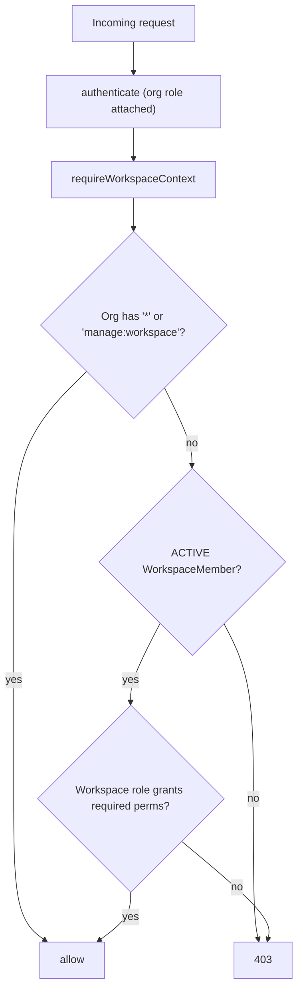
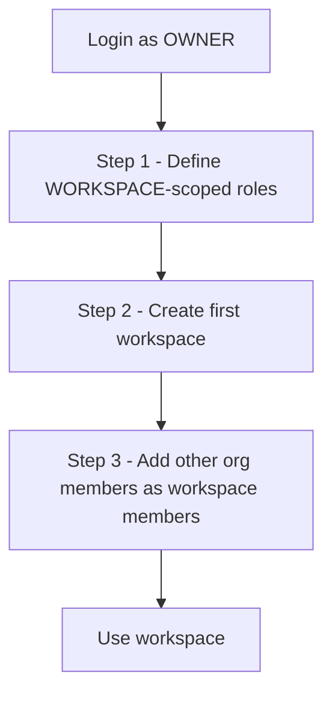
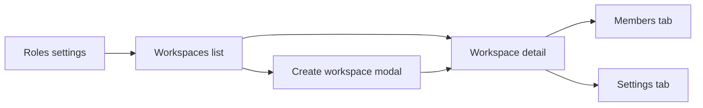

# Workspace Layer

This document describes the design, API surface, RBAC model, edge cases,
and audit-log behavior of the Workspace layer (`Workspace` +
`WorkspaceMember`).

## 1. Conceptual model

```text
Organisation (tenant)
└── Workspace (project / team / department)
    ├── WorkspaceMember (user x workspace, with a workspace-scoped Role)
    ├── Status, Label (workspace-scoped configuration)
    └── Task (the unit of work; references workspace)
```

- A **Workspace** is a silo of work inside an organisation. Tasks,
  statuses, and labels all live under a workspace.
- A **WorkspaceMember** maps a `User` to a `Workspace` with a
  `WORKSPACE`-scoped `Role`. A user must already be an `ACTIVE`
  `OrganisationMember` before they can become a `WorkspaceMember`.
- Workspaces are soft-deleted (archived) so audit trails and historical
  references survive.

## 2. Hybrid RBAC model

The Workspace layer uses a **hybrid permission model** layered on top of
the existing org RBAC:



Concretely:

1. If the requester's **org-level** role includes `*` (super admin) or
   `manage:workspace`, they bypass workspace checks entirely. This lets
   org Owners/Admins act on any workspace in their tenant without being
   added as a member.
2. Otherwise the requester must have an `ACTIVE` `WorkspaceMember` whose
   `Role.permissions` include every required workspace permission.

### Permission strings used

| Layer     | Permission                  | Granted by default to | Notes |
|-----------|-----------------------------|------------------------|-------|
| Org       | `create:workspace`          | `OWNER`               | Authorises `POST /api/workspaces`. |
| Org       | `read:workspace`            | `OWNER`               | Authorises listing workspaces (the visibility scope still narrows by membership unless bypass perms are present). |
| Org       | `manage:workspace`          | `OWNER`               | Bypass perm — grants any action on any workspace in the tenant. |
| Workspace | `read:workspace`            | Workspace-scoped role | View workspace details and members. |
| Workspace | `update:workspace`          | Workspace-scoped role | Rename, edit description, restore. |
| Workspace | `delete:workspace`          | Workspace-scoped role | Archive (soft-delete). |
| Workspace | `manage:workspace_members`  | Workspace-scoped role | Add/remove members and change their role. |

A new tenant's `OWNER` role is seeded with all of the org-level perms
above (see [src/services/authService.js](../src/services/authService.js)).
Existing tenants need to add these perms to their custom roles via the
existing `PUT /api/roles/:id` endpoint.

## 3. Models

### Workspace

| Field         | Type            | Notes                                                            |
|---------------|-----------------|------------------------------------------------------------------|
| `name`        | String, req     | Trim, max 100 chars. Unique per org.                              |
| `slug`        | String, req     | Lowercased, derived from name if not provided. Unique per org.   |
| `description` | String          | Trim, max 500 chars.                                             |
| `organisation`| ObjectId, req   | Tenant boundary.                                                 |
| `createdBy`   | ObjectId, req   | The user who created the workspace.                              |
| `isActive`    | Boolean         | Soft-delete flag. Default `true`.                                |
| `archivedAt`  | Date            | Set when archived; cleared on restore.                           |
| `metadata`    | Map (Mixed)     | Per-workspace settings (theme, automation flags, etc.).          |

Indexes:
- `{ organisation: 1, slug: 1 }` unique
- `{ organisation: 1, name: 1 }` unique
- `{ organisation: 1 }`, `{ isActive: 1 }` (single-field, on-schema)

### WorkspaceMember

| Field       | Type           | Notes                                                       |
|-------------|----------------|-------------------------------------------------------------|
| `user`      | ObjectId, req  | The user.                                                   |
| `workspace` | ObjectId, req  | The workspace.                                              |
| `role`      | ObjectId, req  | A `Role` with `scope: 'WORKSPACE'` (or global workspace).   |
| `status`    | Enum           | `ACTIVE | SUSPENDED | INVITED`. Default `ACTIVE`.            |
| `addedBy`   | ObjectId       | Who added them (creator or admin).                          |

Indexes:
- `{ user: 1, workspace: 1 }` unique
- `{ workspace: 1, role: 1 }`
- `{ user: 1, status: 1 }`

## 4. API reference

All endpoints require `Authorization: Bearer <token>` and an org context
(via the user's single membership or an explicit `x-org-id` header).

### Org-level endpoints

| Method | Path                        | Permission         | Body                                                                                                                                          | Returns |
|--------|-----------------------------|--------------------|-----------------------------------------------------------------------------------------------------------------------------------------------|---------|
| POST   | `/api/workspaces`           | `create:workspace` | `{ name, slug?, description?, creatorRoleId | role | roleId, initialMembers?: [{ userId, roleId }] }`                                          | `{ workspace, memberFailures }` |
| GET    | `/api/workspaces`           | `read:workspace`   | query: `?page&limit&includeArchived=true`                                                                                                     | `{ items, page, limit, total }` |

`creatorRoleId` accepts the aliases `creatorRole`, `roleId`, or `role`
for FE convenience.

### Workspace-scoped endpoints

| Method | Path                                          | Permission                        | Notes |
|--------|-----------------------------------------------|-----------------------------------|-------|
| GET    | `/api/workspaces/:id`                         | `read:workspace`                  | Returns `{ workspace, memberCount }`. |
| PUT    | `/api/workspaces/:id`                         | `update:workspace`                | Body: `{ name?, slug?, description?, metadata? }`. |
| DELETE | `/api/workspaces/:id`                         | `delete:workspace`                | Soft-delete — sets `isActive=false`, `archivedAt=now`. |
| PATCH  | `/api/workspaces/:id/restore`                 | `update:workspace`                | Operates on archived workspaces. |
| GET    | `/api/workspaces/:id/members`                 | `read:workspace`                  | query: `?status&page&limit`. |
| POST   | `/api/workspaces/:id/members`                 | `manage:workspace_members`        | Body: `{ userId, roleId | role }`. |
| PUT    | `/api/workspaces/:id/members/:memberId`       | `manage:workspace_members`        | `:memberId` accepts either `WorkspaceMember._id` or the underlying `User._id`. Body: `{ roleId | role }`. |
| DELETE | `/api/workspaces/:id/members/:memberId`       | `manage:workspace_members`        | Hard-removes the membership row (the underlying `User` is preserved). |

## 5. Activity log events

Every mutating endpoint emits an `ActivityLog` entry via the fail-safe
`logActivity` helper. RBAC events from this layer always populate both
`organisation` and `workspace`.

| `entityType`        | `action`        | When |
|---------------------|-----------------|------|
| `Workspace`         | `created`       | `POST /api/workspaces` succeeds. Metadata includes `name`, `slug`, `creatorRoleId`, `initialMemberCount`, `memberFailures`. |
| `Workspace`         | `updated`       | `PUT /api/workspaces/:id`. Metadata includes `before`/`after` of `name`/`slug`/`description`. |
| `Workspace`         | `archived`      | `DELETE /api/workspaces/:id`. |
| `Workspace`         | `restored`      | `PATCH /api/workspaces/:id/restore`. |
| `WorkspaceMember`   | `created`       | Member added (either via `POST /:id/members` or as part of workspace creation). |
| `WorkspaceMember`   | `role_changed`  | Member's role updated. |
| `WorkspaceMember`   | `deleted`       | Member removed. |

Logging failures are non-fatal; they do not roll back the parent
operation.

## 6. Edge cases & guarantees

| Case                                                                  | Behaviour |
|-----------------------------------------------------------------------|-----------|
| `:id` not a valid ObjectId                                            | `400 Invalid workspace id` (or `400 Invalid id format` from error handler). |
| Workspace belongs to a different org                                  | `404 Workspace not found` (no cross-tenant existence leakage). |
| Mutating an archived workspace                                        | `400` from `requireWorkspaceContext`; `PATCH /restore` is the only endpoint that allows it. |
| Creator role missing                                                  | `400 creatorRoleId is required`. |
| Creator role exists but has scope `'ORGANISATION'`                    | `400 creatorRoleId is invalid or not a WORKSPACE-scoped role for this organisation`. |
| Slug collision in same org                                            | `409 Duplicate value for organisation, slug` from the upgraded error handler. |
| Name collision in same org                                            | `409 Duplicate value for organisation, name`. |
| Initial member who isn't an org member                                | Whole creation aborted *before* any DB writes — `400 User <id> is not an active member of this organisation`. |
| Initial-member entry duplicating the creator                          | Silently skipped. The creator's membership comes from `creatorRoleId`. |
| Concurrent add of the same `(user, workspace)` pair                   | Second insert hits the unique index → surfaced as `409 Duplicate value for user, workspace`. |
| Adding a user who is already a workspace member                       | `400 User is already a member of this workspace`. |
| Self-removal from a workspace                                         | Allowed (per the product spec — no last-admin rule at this layer). Org-level self-removal is still blocked. |
| Removing the only member with `manage:workspace_members`              | Allowed. Org bypass perms still let an org Admin recover the workspace. |
| Listing workspaces as a regular user                                  | Returns only workspaces where the user is an `ACTIVE` member. |
| Listing as a user with `*` or `manage:workspace`                      | Returns every workspace in the org (subject to `includeArchived`). |
| Pagination                                                            | `?page` (min 1) and `?limit` (capped at 100 for workspaces, 200 for members). Defaults: 20 / 50. |
| Bypass perms but not a workspace member                               | All workspace endpoints still work. The middleware allows context loading without a `WorkspaceMember`. |

## 7. Migration / rollout notes

The schema upgrade adds these fields to existing collections:

- `Workspace.slug` (required) — backfill before deploying if you have
  existing rows. Suggested mongo shell:
  ```js
  db.workspaces.find({ slug: { $exists: false } }).forEach(w => {
    const slug = w.name.toLowerCase()
      .replace(/[^a-z0-9]+/g, '-')
      .replace(/^-+|-+$/g, '')
      .slice(0, 80);
    db.workspaces.updateOne({ _id: w._id }, { $set: { slug } });
  });
  ```
- `Workspace.createdBy` (required) — backfill from `OrganisationMember`
  (any active OWNER) or set to a system user. Without a value the
  schema will reject saves on the new field.
- `Workspace.archivedAt` — optional, no backfill needed.
- `WorkspaceMember.status` — defaults to `ACTIVE`; existing rows pick it
  up automatically on next save.
- `WorkspaceMember.addedBy` — optional, no backfill needed.

Existing tenants need to add the new permissions
(`create:workspace`, `read:workspace`, `update:workspace`,
`delete:workspace`, `manage:workspace`, `manage:workspace_members`) to
their custom roles via the existing `PUT /api/roles/:id` endpoint.
Newly registered tenants get them automatically via
`registerTenant()`.

## 8. Frontend integration guide

This section is the contract between the backend and the FE for the
Workspace phase. It describes the required setup, the suggested UI
flows, the permission-aware rendering rules, and the canonical
request/response shapes.

### 8.1 HTTP setup

All workspace endpoints require:

- `Authorization: Bearer <jwt>` — token returned by `POST /api/auth/login`.
- `x-org-id: <organisationId>` (only required when the logged-in user
  belongs to more than one organisation; otherwise it's optional).
- `Content-Type: application/json` for any request with a body.

Recommended axios instance:

```javascript
import axios from 'axios';

export const api = axios.create({
    baseURL: import.meta.env.VITE_API_BASE_URL || 'http://localhost:5000/api',
});

api.interceptors.request.use((config) => {
    const token = localStorage.getItem('token');
    const orgId = localStorage.getItem('activeOrgId');
    if (token) config.headers.Authorization = `Bearer ${token}`;
    if (orgId) config.headers['x-org-id'] = orgId;
    return config;
});
```

### 8.2 Canonical response shapes

Every endpoint returns one of:

```json
// Success
{ "success": true, "data": <payload>, "message"?: "..." }

// Failure
{ "success": false, "error": "<human readable>", "stack"?: "..." }
```

HTTP status codes the FE should handle:

| Status | Meaning                                | Suggested UX                                       |
|--------|----------------------------------------|----------------------------------------------------|
| 400    | Validation / bad request               | Inline form error (use `error` as label).          |
| 401    | Token missing / invalid                | Redirect to `/login`.                              |
| 403    | Permission denied                      | Toast "You don't have access" — never throw users. |
| 404    | Not found / cross-tenant probe         | Redirect to workspaces list with toast.            |
| 409    | Duplicate (slug / name / membership)   | Inline form error on the offending field.          |
| 5xx    | Server error                           | Generic toast + retry option.                      |

### 8.3 Onboarding flow (for a freshly-registered tenant)



A brand-new tenant has only the `OWNER` role and no workspace-scoped
roles. Before any workspace can be created, the FE must let the OWNER
define at least one `WORKSPACE`-scoped role.

#### Step 1 — Create workspace-scoped roles

`POST /api/roles`

```json
{
  "name": "WORKSPACE_OWNER",
  "scope": "WORKSPACE",
  "description": "Full control inside this workspace",
  "permissions": [
    "read:workspace",
    "update:workspace",
    "delete:workspace",
    "manage:workspace_members",
    "create:task",
    "read:task",
    "update:task",
    "delete:task"
  ]
}
```

Recommended seed set the FE can ship as a "one-click" onboarding action:

| Suggested name    | Permissions                                                                                                                                  |
|-------------------|----------------------------------------------------------------------------------------------------------------------------------------------|
| `WORKSPACE_OWNER` | `read:workspace`, `update:workspace`, `delete:workspace`, `manage:workspace_members`, `create:task`, `read:task`, `update:task`, `delete:task` |
| `WORKSPACE_ADMIN` | `read:workspace`, `update:workspace`, `manage:workspace_members`, `create:task`, `read:task`, `update:task`                                  |
| `WORKSPACE_MEMBER`| `read:workspace`, `create:task`, `read:task`, `update:task`                                                                                  |
| `WORKSPACE_VIEWER`| `read:workspace`, `read:task`                                                                                                                |

To populate role pickers later, fetch them with the scope filter:

```http
GET /api/roles?scope=WORKSPACE
```

#### Step 2 — Create the first workspace

`POST /api/workspaces`

```json
{
  "name": "Engineering",
  "description": "Core product team",
  "creatorRoleId": "<id of WORKSPACE_OWNER role>",
  "initialMembers": [
    { "userId": "<some org member>", "roleId": "<WORKSPACE_MEMBER id>" }
  ]
}
```

Response:

```json
{
  "success": true,
  "data": {
    "workspace": { "_id": "...", "name": "Engineering", "slug": "engineering", ... },
    "memberFailures": []
  }
}
```

`memberFailures` is a list of `{ userId, error }` for any initial members
that failed *after* the workspace was created (e.g. a unique-index race).
The workspace itself succeeded; surface those entries in a non-blocking
toast and let the user retry adding them via the members page.

#### Step 3 — Manage members

`POST /api/workspaces/:id/members` to add, `PUT /api/workspaces/:id/members/:memberId`
to change role, `DELETE /api/workspaces/:id/members/:memberId` to remove.
The `:memberId` accepts either the `WorkspaceMember._id` or the
underlying `User._id`, so it's safe to pass `member.user._id` from a
populated list.

### 8.4 UI screens



#### Workspaces list (`GET /api/workspaces`)

- Always paginated. Send `?page=1&limit=20` and render a paginator using
  `data.total`.
- Include a "Show archived" toggle. When ON, send
  `?includeArchived=true`. The backend silently ignores this for users
  without org bypass perms, so non-admins won't see archived rows.
- Show a "New workspace" button only if the logged-in user has
  `create:workspace` in their org permissions (read from JWT — see 8.6).

```javascript
const { data } = await api.get('/workspaces', {
    params: { page, limit: 20, includeArchived },
});
// data.data === { items, page, limit, total }
```

#### Create workspace modal

Form fields:

- `name` (required, max 100 chars, unique within org).
- `slug` (optional; auto-derived from `name` server-side; show a preview
  computed on the client too: `slugify(name)`).
- `description` (optional, max 500).
- `creatorRoleId` (required; populate from `GET /api/roles?scope=WORKSPACE`).
- `initialMembers[]` (optional repeating row with `userId` from
  `GET /api/users` and `roleId` from the same role list).

Show field-level errors when the API returns 400/409 with messages like
`Workspace name is required`, `Duplicate value for organisation, slug`,
`User <id> is not an active member of this organisation`.

#### Workspace detail (`GET /api/workspaces/:id`)

- Returns `{ workspace, memberCount }`.
- Use `workspace.isActive === false` (or `archivedAt != null`) to render
  an "Archived" banner with a "Restore" CTA.
- Edit/Archive/Restore buttons should be disabled if the user lacks the
  corresponding permission (see 8.6).

#### Members page (`GET /api/workspaces/:id/members`)

- Paginated; default `?limit=50`.
- Filter dropdown for `?status=ACTIVE|SUSPENDED|INVITED`.
- Each row exposes:
  - User name/email/avatar (`item.user`).
  - Current role (`item.role.name` + permissions tooltip).
  - Role-change select (writes via `PUT /api/workspaces/:id/members/:memberId`).
  - Remove button (`DELETE /api/workspaces/:id/members/:memberId`).
- Self-removal is allowed by the backend at this layer; the FE may still
  show a confirmation dialog ("You'll lose access to this workspace").

### 8.5 Editing / archiving / restoring

- `PUT /api/workspaces/:id` accepts a partial body
  `{ name?, slug?, description?, metadata? }` — send only changed fields.
- `DELETE /api/workspaces/:id` archives. The row stays returned in lists
  only when `?includeArchived=true`.
- `PATCH /api/workspaces/:id/restore` un-archives. This is the only
  endpoint that works on archived workspaces; the rest return
  `400 Workspace is archived` until restore.

### 8.6 Permission-aware UI

The FE must decide which buttons to show. It has two sources of truth:

1. **Org-level permissions** — embedded in the JWT and surfaced on the
   `POST /api/auth/login` response under
   `data.organisations[i].role` (currently the role's *name*; if you
   need the full permission list on the FE without an extra round-trip,
   extend the login response, otherwise call `GET /api/roles/:id`).
2. **Workspace-level permissions** — derive from the requester's
   `WorkspaceMember`. Since there's no dedicated `/me` endpoint yet,
   pull them by filtering `GET /api/workspaces/:id/members` for the
   logged-in user, e.g.:

   ```javascript
   async function loadEffectivePerms(workspaceId, currentUserId, orgPerms) {
       const orgBypass = orgPerms.includes('*') || orgPerms.includes('manage:workspace');
       if (orgBypass) {
           return { bypass: true, perms: ['*'] };
       }
       const { data } = await api.get(`/workspaces/${workspaceId}/members`, {
           params: { limit: 200 },
       });
       const me = data.data.items.find(
           (m) => String(m.user?._id) === String(currentUserId)
       );
       return { bypass: false, perms: me?.role?.permissions || [] };
   }
   ```

Use the resulting `perms` array to gate UI:

```javascript
const can = (perm) => effective.bypass || effective.perms.includes('*') || effective.perms.includes(perm);

<Button disabled={!can('update:workspace')}>Edit</Button>
<Button disabled={!can('delete:workspace')}>Archive</Button>
<Button disabled={!can('manage:workspace_members')}>Add member</Button>
```

Even with FE gating, the API still enforces every check, so this is a
UX layer, not a security layer.

### 8.7 Worked examples

```javascript
// Create a workspace-scoped role (one-time onboarding)
await api.post('/roles', {
    name: 'WORKSPACE_MEMBER',
    scope: 'WORKSPACE',
    permissions: ['read:workspace', 'create:task', 'read:task'],
});

// List workspace-scoped roles for pickers
const { data: roles } = await api.get('/roles', { params: { scope: 'WORKSPACE' } });

// Create a workspace
const { data: created } = await api.post('/workspaces', {
    name: 'Marketing',
    description: 'Brand + growth',
    creatorRoleId: roles.data.find((r) => r.name === 'WORKSPACE_OWNER')._id,
});

// Add another member
await api.post(`/workspaces/${created.data.workspace._id}/members`, {
    userId: orgMember.user._id,
    roleId: roles.data.find((r) => r.name === 'WORKSPACE_MEMBER')._id,
});

// Change a member's role (memberId can be WorkspaceMember._id OR User._id)
await api.put(`/workspaces/${wsId}/members/${member._id}`, {
    roleId: workspaceAdminRoleId,
});

// Archive
await api.delete(`/workspaces/${wsId}`);

// Restore
await api.patch(`/workspaces/${wsId}/restore`);
```

### 8.8 Don'ts (common pitfalls)

- Don't pass a `scope: 'ORGANISATION'` role as `creatorRoleId` — it's
  rejected with 400. Always source role pickers from `?scope=WORKSPACE`.
- Don't try to `PUT /api/workspaces/:id` on an archived workspace — it
  returns 400. Restore first.
- Don't assume `GET /api/workspaces` returns every workspace — for
  non-bypass users it's filtered to `ACTIVE` memberships only.
- Don't store stale role permissions client-side after editing a role
  via `PUT /api/roles/:id`; refresh the role list and any cached
  membership perms.
- Don't pass arbitrary permission strings on workspace-scoped roles. If
  a permission isn't in the catalogue (section 2 above + future
  task-engine perms), the backend stores it but no middleware checks
  for it, so the role becomes effectively a no-op for that permission.

## 9. Out of scope (next phase)

- Cascading archive of `Task`, `Status`, `Label` rows when a workspace
  is archived. Currently they're left as-is so the audit trail and any
  unsuspended work survives a restore.
- Workspace-level invitations with email (the schema supports
  `status: 'INVITED'` already).
- Cross-org workspace transfer.
- Per-workspace seed of default `Status`/`Priority` rows.
